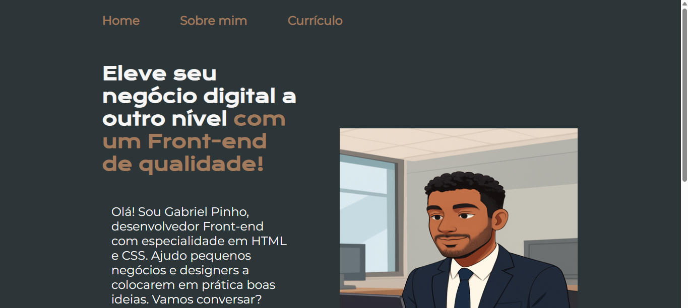

# 💼 Página de Serviços | Meu Primeiro Projeto

Este é o **primeiro projeto** que desenvolvi, uma **página pessoal** oferecendo meus serviços como desenvolvedor.  
O objetivo foi praticar **HTML5** e **CSS3** criando uma landing page simples e direta para apresentar meu trabalho.

---

## 🖼️ Prévia do site

---

## 🚀 Tecnologias utilizadas
- HTML5  
- CSS3  

---

## 📌 O que aprendi com este projeto
- Estruturar uma página de apresentação profissional  
- Trabalhar com textos, imagens e estilização no CSS  
- Criar uma **landing page** clara e objetiva para serviços  
